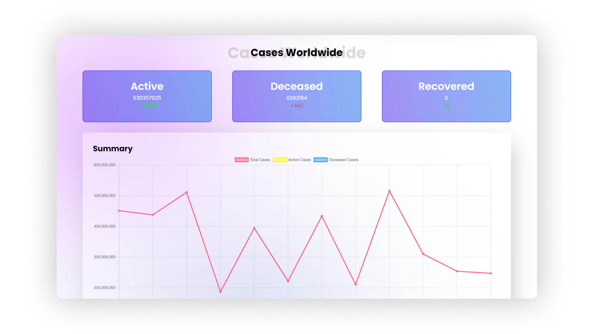

# Covid-19 Stats App


## UI Design





## Setting up locally

```
git clone https://github.com/siddhantprateek/covid19-stats.git
cd covid19-stats
npm install
npm run client && npm run server

```
### Targets
- [x] Use Graphql for fetching data on the frontend.
- [x] Add authentication for logging in to the app.
- [ ] Use typescript instead of js as the primary language for the app.
### My Learnings from this Assignment

* Since this was my first time using GraphQL, I have learn't, how to setup and how to query data from GraphQL. I probably I won't be using REST Api for a while.


